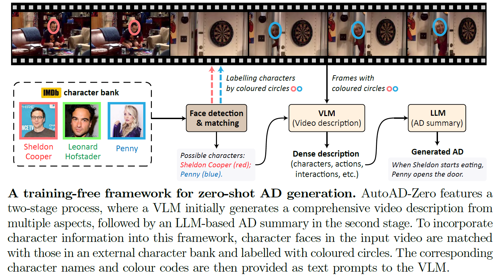

# AutoAD-Zero: A Training-Free Framework for Zero-Shot Audio Description

Junyu Xie<sup>1</sup>, Tengda Han<sup>1</sup>, Max Bain<sup>1</sup>, Arsha Nagrani<sup>1</sup>, Gül Varol<sup>1</sup> <sup>2</sup>, Weidi Xie<sup>1</sup> <sup>3</sup>, Andrew Zisserman<sup>1</sup>

<sup>1</sup> Visual Geometry Group, Department of Engineering Science, University of Oxford <br>
<sup>2</sup> LIGM, École des Ponts, Univ Gustave Eiffel, CNRS <br>
<sup>3</sup> CMIC, Shanghai Jiao Tong University

<a src="https://img.shields.io/badge/cs.CV-xxxx.xxxxxx-b31b1b?logo=arxiv&logoColor=red" href="https://arxiv.org/abs/xxxx.xxxxxx">  
</a>
<a href="https://www.robots.ox.ac.uk/~vgg/research/autoad-zero/" alt="Project page"> 
</a>
<a href="https://www.robots.ox.ac.uk/~vgg/research/autoad-zero/#tvad" alt="Dataset"> 
</a>
<br>
<br>
<p align="center">
  
</p>


## Requirements
* **Basic Dependencies:** 
```pytorch=2.0.0```,
```Pillow```,
```pandas```,
```decord```,
```opencv```,
```transformers=4.37.2```

* **[VideoLLaMA2](https://github.com/DAMO-NLP-SG/VideoLLaMA2)**:
After installation, modify the `sys.path.append("/path/to/VideoLLaMA2")` in `stage1/main.py` and `stage1/utils.py`. Please download the VideoLLaMA2-7B checkpoint [here](https://huggingface.co/DAMO-NLP-SG/VideoLLaMA2-7B).

* Set up cache model path (for LLaMA3, etc.) by modifying `os.environ['TRANSFORMERS_CACHE'] = "/path/to/cache/"` in `stage1/main.py` and `stage2/main.py`


## Datasets 
In this work, we evaluate our model on [CMD-AD](https://www.robots.ox.ac.uk/~vgg/research/autoad/), [MAD-Eval](https://github.com/Soldelli/MAD), and [TV-AD](https://www.robots.ox.ac.uk/~vgg/research/autoad-zero/#tvad).
#### Video Frames
* **CMD-AD** can be downloaded [here](https://github.com/TengdaHan/AutoAD/tree/main/autoad_iii). 
* **MAD-Eval** can be downloaded [here](https://github.com/Soldelli/MAD). 
* **TV-AD** adopts a subset of TV-QA as visual sources (3fps), and can be downloaded [here](https://nlp.cs.unc.edu/data/jielei/tvqa/tvqa_public_html/download_tvqa_plus.html). Each folder containing .jpg video frames needs to be converted to a .tar file. This can be done by the code provided in `tools/compress_subdir.py`. <br> For example, 
  ```
  python tools/compress_subdir.py \
  --root_dir="resources/example_file_structures/tvad_raw/" \   # for downloaded raw (.jpg folders) files from TVQA
  --save_dir="resources/example_file_structures/tvad/"         # for compressed tar files
  ```
#### Ground Truth AD Annotations
* All annotations can be found in `resources/annotations`


## Results
* The AutoAD-Zero predictions can be downloaded [here](https://drive.google.com/drive/folders/1WMTwsDwu59kS38Z3BAOjbATAywUWZDZF?usp=sharing).


## Inference
#### Stage I: VLM-Based Dense Video Description
```
python stage1/main.py \
--dataset={dataset} \                  #e.g. "cmdad"
--video_dir={video_dir} \
--anno_path={anno_path} \              #e.g. "resources/annotations/cmdad_anno_with_face_0.2_0.4.csv"
--charbank_path={charbank_path} \      #e.g. "resources/charbanks/cmdad_charbank.json" 
--model_path={videollama2_ckpt_path} \
--output_dir={output_dir}
```
`--dataset`: choices are `cmdad`, `madeval`, and `tvad`. <br>
`--video_dir`: directory of video datasets, example file structures can be found in `resources/example_file_structures` (files are empty, for references only). <br>
`--anno_path`: path to AD annotations *(with predicted face IDs and bboxes)*, available in `resources/annotations`. <br>
`--charbank_path`: path to external character banks, available in `resources/charbanks`. <br>
`--model_path`: path to videollama2 checkpoint. <br>
`--output_dir`: directory to save output csv. <br>

#### Stage II: LLM-Based AD Summary
```
python stage2/main.py \
--dataset={dataset} \             #e.g. "cmdad"
--pred_path={stage1_result_path} 
```
`--dataset`: choices are `cmdad`, `madeval`, and `tvad`. <br>
`--pred_path`: path to the stage1 saved csv file.


## Citation
If you find this repository helpful, please consider citing our work:
```
@article{xie2024autoad0,
	title={AutoAD-Zero: A Training-Free Framework for Zero-Shot Audio Description},
	author={Junyu Xie and Tengda Han and Max Bain and Arsha Nagrani and G\"ul Varol and Weidi Xie and Andrew Zisserman},
	journal={arXiv preprint arXiv:xxxx:xxxxxx},
	year={2024}
}
```

## References
VideoLLaMA2: [https://github.com/DAMO-NLP-SG/VideoLLaMA2](https://github.com/DAMO-NLP-SG/VideoLLaMA2) <br>
LLaMA3: [https://huggingface.co/meta-llama/Meta-Llama-3-8B-Instruct](https://huggingface.co/meta-llama/Meta-Llama-3-8B-Instruct)


 
