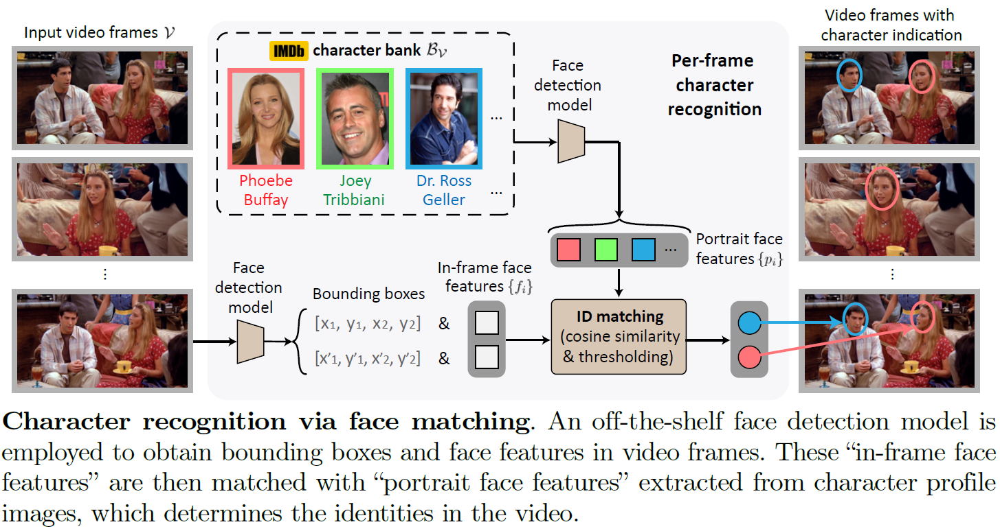

# Character Recognition via Face Matching
<p align="center">
  
</p>

## Preparation
The actor profile images were downloaded from IMDB page. The collection of images can be downloaded [here (27GB)](https://thor.robots.ox.ac.uk/autoad/actor_profiles.tar).
<br> After downloading, un-tar the file to a profile image folder for the next-step usage.

## Inference
```
python main.py \
--dataset={dataset} \                  #e.g. "cmdad"
--video_dir={video_dir} \
--anno_path={anno_path} \              #e.g. "resources/annotations/cmdad_anno.csv"
--charbank_path={charbank_path} \      #e.g. "resources/charbanks/cmdad_charbank.json" 
--profile_dir={profile_dir} \
--output_dir={output_dir}
```
`--dataset`: choices are `cmdad`, `madeval`, and `tvad`. <br>
`--video_dir`: directory of video datasets, example file structures can be found in [`resources/example_file_structures`](../resources/example_file_structures) (files are empty, for references only). <br>
`--anno_path`: path to AD annotations, available in [`resources/annotations`](../resources/annotations). <br>
`--charbank_path`: path to external character banks, available in [`resources/charbanks`](../resources/charbanks). <br>
`--profile_dir`: directory of actor profile images. <br>
`--output_dir`: directory to save output csv. <br>

## References
InsightFace: [https://github.com/deepinsight/insightface](https://github.com/deepinsight/insightface) 
